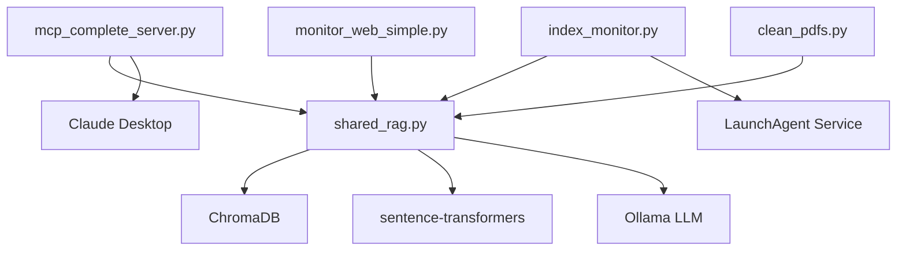

# Project Structure

## Repository Overview
```
spiritual-library-mcp/
├── 📁 Core Components
│   ├── mcp_complete_server.py     # Main MCP server (9 tools, full features)
│   ├── shared_rag.py             # Core RAG functionality 
│   ├── index_monitor.py          # Background indexing service
│   └── monitor_web_simple.py     # Web monitoring dashboard
│
├── 📁 Utilities & Scripts
│   ├── clean_pdfs.py            # PDF cleaning utility
│   ├── setup-script.sh          # Initial setup script
│   ├── run.sh                   # Manual server runner
│   ├── index_monitor.sh         # Start background monitor
│   ├── stop_monitor.sh          # Stop background monitor
│   ├── install_service.sh       # Install as LaunchAgent
│   ├── uninstall_service.sh     # Remove service
│   └── service_status.sh        # Check service health
│
├── 📁 Alternative Servers
│   └── mcp_final_server.py      # Minimal server (fallback option)
│
├── 📁 Documentation
│   ├── README.md                # Main project documentation
│   ├── CLAUDE.md               # Claude Code instructions
│   ├── CHANGELOG.md            # Version history
│   ├── CONTRIBUTING.md         # Contribution guidelines
│   ├── LICENSE                 # MIT License
│   └── SERVER_COMPARISON.md    # Server comparison guide
│
├── 📁 Configuration
│   ├── requirements.txt        # Python dependencies
│   ├── .gitignore             # Git ignore patterns
│   └── backup/                # Legacy/backup files
│
├── 📁 GitHub Infrastructure
│   └── .github/
│       ├── workflows/test.yml  # CI/CD pipeline
│       ├── ISSUE_TEMPLATE/     # Bug report & feature templates
│       └── PULL_REQUEST_TEMPLATE.md
│
└── 📁 Runtime (created automatically)
    ├── books/                  # PDF library directory
    ├── chroma_db/             # Vector database storage
    ├── venv_mcp/              # ARM64 virtual environment
    └── logs/                  # Application logs
```

## Core Components

### MCP Server (`mcp_complete_server.py`)
- **Purpose**: Main Model Context Protocol server
- **Features**: 9 tools, lazy initialization, ARM64 compatible
- **Tools**: search, find_practices, compare_perspectives, library_stats, index_status, summarize_book, extract_quotes, daily_reading, question_answer

### Shared RAG (`shared_rag.py`)
- **Purpose**: Core RAG functionality used by both server and monitor
- **Features**: ChromaDB integration, PDF processing, lock management
- **Embedding**: sentence-transformers/all-mpnet-base-v2 (768-dim)

### Index Monitor (`index_monitor.py`)
- **Purpose**: Background service for automatic indexing
- **Features**: File watching, automatic PDF processing, service mode
- **Usage**: Optional for instant indexing when books are added

### Web Monitor (`monitor_web_simple.py`)
- **Purpose**: Real-time status dashboard
- **Features**: Live statistics, indexing progress, health monitoring
- **Access**: http://localhost:8888

## Usage Modes

### 1. Automatic Mode (Default)
```bash
# Just use Claude Desktop
# Books indexed on first search after adding
```

### 2. Background Mode  
```bash
./index_monitor.sh    # Start background monitoring
# Books indexed instantly when added to books/
```

### 3. Manual Mode
```bash
./run.sh             # Manual indexing and server operation
```

### 4. Service Mode (Advanced)
```bash
./install_service.sh # Install as system service
# Runs automatically on startup
```

## File Dependencies



## Configuration Files

### Claude Desktop Config
- **Location**: `~/Library/Application Support/Claude/claude_desktop_config.json`
- **Purpose**: MCP server integration with Claude Desktop
- **Critical**: Must use ARM64 virtual environment path

### Service Configuration  
- **Location**: `~/Library/LaunchAgents/com.spiritual-library.index-monitor.plist`
- **Purpose**: Background service configuration
- **Created by**: `install_service.sh`

### Environment Files
- **requirements.txt**: Python package dependencies
- **setup-script.sh**: One-time environment setup
- **.gitignore**: Excludes runtime data and logs

## Data Flow

1. **PDF Input**: Place PDFs in `books/` directory
2. **Processing**: PyPDF2 extracts text, RecursiveCharacterTextSplitter chunks
3. **Embedding**: sentence-transformers generates 768-dim vectors  
4. **Storage**: ChromaDB stores vectors with metadata
5. **Search**: Claude queries via MCP → semantic search → LLM synthesis
6. **Response**: Structured results with sources and page numbers

## Development Workflow

1. **Setup**: Run `./setup-script.sh` for initial environment
2. **Development**: Edit source files, test with `./run.sh`
3. **Testing**: Use web monitor for debugging
4. **Integration**: Test with Claude Desktop
5. **Service**: Install as service for production use

## Backup Strategy

- **Legacy files**: Stored in `backup/` directory
- **Configuration**: Document in CLAUDE.md for reproducibility  
- **Database**: ChromaDB can be rebuilt from books/ directory
- **Code**: Version controlled with git

## Performance Characteristics

- **Startup**: <2 seconds (lazy initialization)
- **Search**: ~1.75s per query (768-dim embeddings)
- **Indexing**: ~10-30 minutes for full library rebuild
- **Memory**: ~40GB for Ollama LLM + embeddings model
- **Storage**: ~55MB ChromaDB for 68 books, 38K chunks