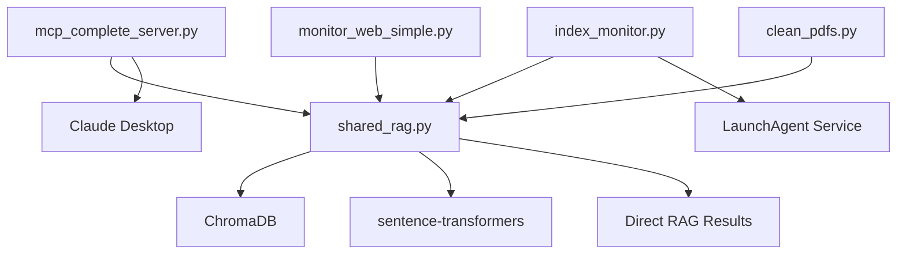

# Project Structure

## Repository Overview
```
spiritual-library-mcp/
├── 📁 Core Components
│   ├── mcp_complete_server.py     # Main MCP server (9 tools, full features)
│   ├── shared_rag.py             # Core RAG functionality 
│   ├── index_monitor.py          # Background indexing service
│   └── monitor_web_simple.py     # Web monitoring dashboard
│
├── 📁 Scripts Directory
│   ├── Core Operations
│   │   ├── run.sh                   # Swiss army knife - MCP server & indexing
│   │   ├── setup-script.sh          # Initial setup (venv, deps, models)
│   │   └── quick_start.sh           # Interactive setup for new users
│   │
│   ├── Background Monitoring
│   │   ├── index_monitor.sh         # Manual background monitor (Ctrl+C to stop)
│   │   ├── stop_monitor.sh          # Stop background monitor gracefully
│   │   └── index_monitor_service.sh # Service wrapper (run by LaunchAgent)
│   │
│   ├── Service Management
│   │   ├── install_service.sh       # Install index monitor as LaunchAgent
│   │   ├── uninstall_service.sh     # Remove index monitor service
│   │   └── service_status.sh        # Check index monitor health
│   │
│   ├── Web Monitor Services
│   │   ├── install_webmonitor_service.sh    # Install web monitor service
│   │   ├── uninstall_webmonitor_service.sh  # Remove web monitor service
│   │   ├── webmonitor_service_status.sh     # Check web monitor status
│   │   └── run_enhanced_monitor.sh          # Manual web dashboard start
│   │
│   ├── Indexing Control
│   │   ├── pause_indexing.sh        # Pause indexing (creates pause file)
│   │   ├── resume_indexing.sh       # Resume indexing (removes pause file)
│   │   └── indexing_status.sh       # Check indexing status/progress
│   │
│   └── Debugging & Maintenance
│       ├── view_mcp_logs.sh         # View MCP logs in real-time
│       ├── test_logs.sh             # Test log viewing functionality
│       └── execute_fresh_indexing.sh # Full reset: backup & fresh index
│
├── 📁 Utilities (Python)
│   └── clean_pdfs.py               # PDF cleaning utility
│
├── 📁 Alternative Servers
│   └── mcp_final_server.py      # Minimal server (fallback option)
│
├── 📁 Documentation
│   ├── README.md                # Main project documentation
│   ├── CLAUDE.md               # Claude Code instructions
│   ├── CHANGELOG.md            # Version history
│   ├── CONTRIBUTING.md         # Contribution guidelines
│   ├── LICENSE                 # MIT License
│   └── SERVER_COMPARISON.md    # Server comparison guide
│
├── 📁 Configuration
│   ├── requirements.txt        # Python dependencies
│   ├── .gitignore             # Git ignore patterns
│   └── backup/                # Legacy/backup files
│
├── 📁 GitHub Infrastructure
│   └── .github/
│       ├── workflows/test.yml  # CI/CD pipeline
│       ├── ISSUE_TEMPLATE/     # Bug report & feature templates
│       └── PULL_REQUEST_TEMPLATE.md
│
└── 📁 Runtime (created automatically)
    ├── books/                  # PDF library directory
    ├── chroma_db/             # Vector database storage
    ├── venv_mcp/              # ARM64 virtual environment
    └── logs/                  # Application logs
```

## Core Components

### MCP Server (`mcp_complete_server.py`)
- **Purpose**: Main Model Context Protocol server
- **Features**: 9 tools, lazy initialization, ARM64 compatible
- **Tools**: search, find_practices, compare_perspectives, library_stats, index_status, summarize_book, extract_quotes, daily_reading, question_answer

### Shared RAG (`shared_rag.py`)
- **Purpose**: Core RAG functionality used by both server and monitor
- **Features**: ChromaDB integration, PDF processing, lock management
- **Embedding**: sentence-transformers/all-mpnet-base-v2 (768-dim)

### Index Monitor (`index_monitor.py`)
- **Purpose**: Background service for automatic indexing
- **Features**: File watching, automatic PDF processing, service mode
- **Usage**: Optional for instant indexing when books are added

### Web Monitor (`monitor_web_simple.py`)
- **Purpose**: Real-time status dashboard
- **Features**: Live statistics, indexing progress, health monitoring
- **Access**: http://localhost:8888

## Scripts Overview

### Script Connection Map
```
User has 3 ways to run the system:

1. MANUAL MODE (run.sh)
   └── Direct execution, no background processes

2. MANUAL BACKGROUND MODE (index_monitor.sh)
   └── Runs in terminal, stays active until Ctrl+C

3. SERVICE MODE (install_service.sh → index_monitor_service.sh)
   └── Runs as system service, survives reboots
```

### Key Scripts Explained

#### **run.sh** (Swiss Army Knife)
- **Purpose**: Main entry point for manual/ad-hoc usage
- **Usage Modes**:
  - `./run.sh` - Run the MCP server (for Claude Desktop)
  - `./run.sh --index-only` - Just index documents once and exit
  - `./run.sh --index-only --retry` - Index with retry logic and memory monitoring
- **When to use**: Testing, one-time indexing, or running the MCP server

#### **index_monitor.sh** (Manual Background Mode)
- **Purpose**: Manually start the background file watcher
- **What it does**: 
  - Runs the Python index_monitor.py directly
  - Watches for new/changed documents in real-time
  - Stays running until you press Ctrl+C
- **When to use**: When you want background monitoring but don't want a system service

#### **index_monitor_service.sh** (Service Worker)
- **Purpose**: The actual service executable run by macOS LaunchAgent
- **What it does**: Same as index_monitor.sh but with:
  - Better signal handling for system shutdown
  - Service-specific logging
  - PID file management
  - CloudDocs permission workaround
- **When to use**: Never run directly - it's run by the system

#### **install_service.sh** (Service Installer)
- **Purpose**: One-time installation of the background service
- **What it does**: 
  - Installs a LaunchAgent that runs index_monitor_service.sh
  - Service starts automatically on boot
  - Runs in background without terminal
- **When to use**: For "set and forget" operation

### Service Chain
```
install_service.sh (run once)
    ↓ creates
LaunchAgent plist file
    ↓ which runs
index_monitor_service.sh (continuously)
    ↓ which runs
python src/indexing/index_monitor.py
```

## Usage Modes

### 1. Developer/Testing Mode
```bash
./scripts/run.sh                    # Run MCP server
./scripts/run.sh --index-only       # One-time indexing
```

### 2. Casual User Mode
```bash
./scripts/index_monitor.sh          # Start monitoring (Ctrl+C to stop)
./scripts/run_enhanced_monitor.sh   # View web dashboard
```

### 3. Power User Mode (Service)
```bash
./scripts/install_service.sh        # Install once
./scripts/service_status.sh         # Check status
# Runs automatically on boot
```

### 4. Claude Desktop Only
```bash
# Just configure Claude Desktop - no scripts needed
# Indexing happens automatically on first query
```

## File Dependencies



## Configuration Files

### Claude Desktop Config
- **Location**: `~/Library/Application Support/Claude/claude_desktop_config.json`
- **Purpose**: MCP server integration with Claude Desktop
- **Critical**: Must use ARM64 virtual environment path

### Service Configuration  
- **Location**: `~/Library/LaunchAgents/com.spiritual-library.index-monitor.plist`
- **Purpose**: Background service configuration
- **Created by**: `install_service.sh`

### Environment Files
- **requirements.txt**: Python package dependencies
- **setup-script.sh**: One-time environment setup
- **.gitignore**: Excludes runtime data and logs

## Data Flow

1. **PDF Input**: Place PDFs in `books/` directory
2. **Processing**: PyPDF2 extracts text, RecursiveCharacterTextSplitter chunks
3. **Embedding**: sentence-transformers generates 768-dim vectors  
4. **Storage**: ChromaDB stores vectors with metadata
5. **Search**: Claude queries via MCP → semantic search → LLM synthesis
6. **Response**: Structured results with sources and page numbers

## Development Workflow

1. **Setup**: Run `./setup-script.sh` for initial environment
2. **Development**: Edit source files, test with `./run.sh`
3. **Testing**: Use web monitor for debugging
4. **Integration**: Test with Claude Desktop
5. **Service**: Install as service for production use

## Backup Strategy

- **Legacy files**: Stored in `backup/` directory
- **Configuration**: Document in CLAUDE.md for reproducibility  
- **Database**: ChromaDB can be rebuilt from books/ directory
- **Code**: Version controlled with git

## Performance Characteristics

- **Startup**: <2 seconds (lazy initialization)
- **Search**: ~1.75s per query (768-dim embeddings)
- **Indexing**: ~10-30 minutes for full library rebuild
- **Memory**: ~4GB for embeddings model
- **Storage**: ~55MB ChromaDB for 68 books, 38K chunks