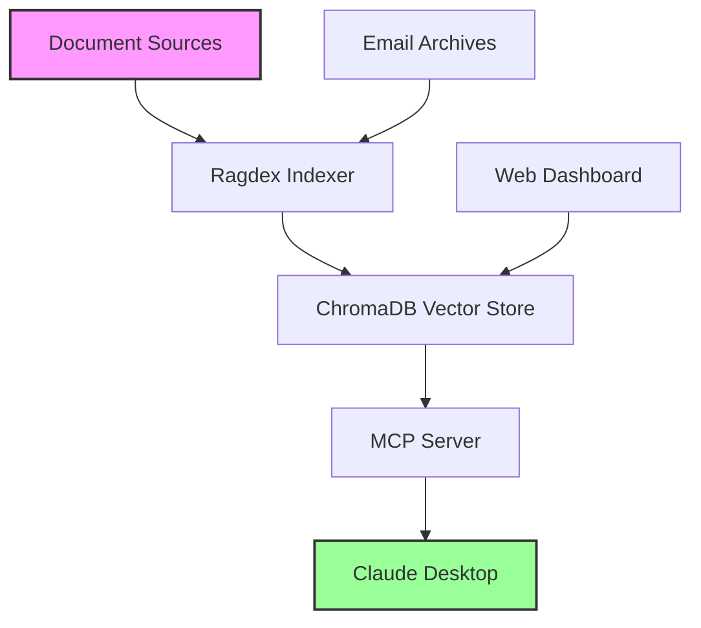

<div align="center">

# 🚀 Ragdex

### Transform Your Documents & Emails into an AI-Powered Knowledge Base

[](https://badge.fury.io/py/ragdex)
[](https://www.python.org/downloads/)
[](https://opensource.org/licenses/MIT)
[](https://modelcontextprotocol.io/)
[](https://pypi.org/project/ragdex/)

**Ragdex** is a powerful Model Context Protocol (MCP) server that transforms your personal document library and email archives into an AI-queryable knowledge base. Built for Claude Desktop and compatible with any MCP client.

[Features](#-features) • [Quick Start](#-quick-start) • [Documentation](#-documentation) • [Examples](#-examples) • [Support](#-support)

</div>

---

## ✨ Features

### 🎯 Core Capabilities

<table>
<tr>
<td width="50%">

#### 📚 Universal Document Support
- **PDFs** with OCR for scanned documents
- **Office Files** (Word, PowerPoint, Excel)
- **E-books** (EPUB, MOBI, AZW, AZW3)
- **Plain Text** and Markdown files
- **Automatic format detection**

</td>
<td width="50%">

#### 📧 Email Intelligence (v0.2.0+)
- **Apple Mail** (EMLX) support
- **Outlook** (OLM export) support
- **Smart filtering** - Skip marketing & spam
- **Attachment processing**
- **Thread reconstruction**

</td>
</tr>
<tr>
<td width="50%">

#### 🔍 Advanced Search & RAG
- **Semantic search** with vector embeddings
- **Cross-document insights**
- **Context-aware responses**
- **17+ specialized MCP tools**
- **Real-time index updates**

</td>
<td width="50%">

#### 🎨 Beautiful Web Dashboard
- **Real-time monitoring** at `localhost:8888`
- **Indexing progress tracking**
- **Document & email statistics**
- **Failed document management**
- **Search interface with filters**

</td>
</tr>
</table>

### 🛠️ MCP Tools Available

| Tool | Description |
|------|-------------|
| 🔍 **search** | Semantic search with optional filters |
| 📊 **compare_perspectives** | Compare viewpoints across documents |
| 📈 **library_stats** | Get comprehensive statistics |
| 📖 **summarize_book** | Generate AI summaries |
| 💭 **extract_quotes** | Find relevant quotes on topics |
| ❓ **question_answer** | Direct Q&A from your library |
| 📚 **list_books** | Browse by pattern/author/directory |
| 📅 **recent_books** | Find recently indexed content |
| 🔄 **refresh_cache** | Update search cache |
| ...and 8 more! | |

### 🎯 Smart Email Filtering

Ragdex intelligently filters out noise from your email archives:

- ❌ **Auto-skips**: Marketing, promotions, shopping receipts, newsletters
- ❌ **Excludes**: Spam, junk, trash folders
- ✅ **Focuses on**: Personal communications, important discussions
- ⚙️ **Configurable**: Whitelist important senders, set date ranges

---

## 🚀 Quick Start

### Installation (2-5 minutes)

```bash
# Using uv (faster, ~2 minutes)
uv venv ~/ragdex_env
uv pip install ragdex

# Or standard pip (~5 minutes)
python -m venv ~/ragdex_env
source ~/ragdex_env/bin/activate
pip install ragdex
```

**Note**: First run will download ~2GB of embedding models (5-10 minutes on broadband)

### Setup Services (2-3 minutes)

```bash
# Download installer
curl -O https://raw.githubusercontent.com/hpoliset/DocumentIndexerMCP/main/install_ragdex_services.sh
chmod +x install_ragdex_services.sh

# Run interactive setup
./install_ragdex_services.sh

# That's it! Services are running
```

### Configure Claude Desktop

After running the installer, it will display a JSON configuration snippet. You need to:

1. **Copy the displayed configuration** (it will look like this):
```json
{
  "mcpServers": {
    "ragdex": {
      "command": "/path/to/ragdex-mcp",
      "env": { ... }
    }
  }
}
```

2. **Open Claude Desktop's config file**:
   - Location: `~/Library/Application Support/Claude/claude_desktop_config.json`
   - You can open it with: `open ~/Library/Application\ Support/Claude/`

3. **Add or merge the configuration**:
   - If the file is empty, paste the entire JSON
   - If you have other servers, add the "ragdex" section to your existing "mcpServers" object

4. **Restart Claude Desktop** for changes to take effect

**Alternative: Automatic Configuration**
```bash
# This script can automatically update your Claude config
curl -O https://raw.githubusercontent.com/hpoliset/DocumentIndexerMCP/main/update_claude_config.sh
chmod +x update_claude_config.sh
./update_claude_config.sh
```

**You're done!** 🎉 Ragdex is now indexing your documents and ready to use with Claude.

---

## 📖 Documentation

### System Requirements

- **Python 3.10-3.12** (3.13 not supported due to dependency conflicts)
- **macOS** (primary) or **Linux** (Windows not yet supported)
- **8GB RAM minimum** (16GB recommended)
  - Embedding model uses ~4GB
  - Document processing can spike to 6-8GB for large PDFs
- **Storage**:
  - ~500MB for Ragdex installation
  - ~2GB for embedding models (auto-downloaded on first run)
  - 1-10GB for vector database (depends on library size)
- **Claude Desktop** (required for MCP integration)
- **Optional dependencies**:
  - Calibre (for MOBI/AZW ebooks)
  - LibreOffice (for .doc files)
  - ocrmypdf (for scanned PDFs)

### Configuration Options

#### Environment Variables

```bash
# Core paths
export PERSONAL_LIBRARY_DOC_PATH="/path/to/documents"
export PERSONAL_LIBRARY_DB_PATH="/path/to/database"
export PERSONAL_LIBRARY_LOGS_PATH="/path/to/logs"

# Email settings (v0.2.0+)
export PERSONAL_LIBRARY_INDEX_EMAILS=true
export PERSONAL_LIBRARY_EMAIL_SOURCES=apple_mail,outlook_local
export PERSONAL_LIBRARY_EMAIL_MAX_AGE_DAYS=365
export PERSONAL_LIBRARY_EMAIL_EXCLUDED_FOLDERS=Spam,Junk,Trash
```

### Claude Desktop Configuration Example

<details>
<summary>📝 Complete Configuration Example</summary>

If this is your first MCP server, your `claude_desktop_config.json` should look like:

```json
{
  "mcpServers": {
    "ragdex": {
      "command": "/Users/yourname/ragdex_env/bin/ragdex-mcp",
      "env": {
        "PYTHONUNBUFFERED": "1",
        "CHROMA_TELEMETRY": "false",
        "PERSONAL_LIBRARY_DOC_PATH": "/Users/yourname/Documents",
        "PERSONAL_LIBRARY_DB_PATH": "/Users/yourname/.ragdex/chroma_db",
        "PERSONAL_LIBRARY_LOGS_PATH": "/Users/yourname/.ragdex/logs"
      }
    }
  }
}
```

If you already have other MCP servers, add ragdex to the existing structure:

```json
{
  "mcpServers": {
    "existing-server": { ... },
    "ragdex": {
      "command": "/Users/yourname/ragdex_env/bin/ragdex-mcp",
      "env": { ... }
    }
  }
}
```

</details>

### Advanced Installation

<details>
<summary>📦 Install with Optional Dependencies</summary>

```bash
# Document processing extras
pip install ragdex[document-processing]

# Service management
pip install ragdex[services]

# Everything
pip install ragdex[document-processing,services]
```

</details>

<details>
<summary>🔧 Install from Source</summary>

```bash
git clone https://github.com/hpoliset/DocumentIndexerMCP
cd DocumentIndexerMCP
pip install -e .

# With extras
pip install -e ".[document-processing,services]"
```

</details>

<details>
<summary>📋 Available CLI Commands</summary>

```bash
# Main commands
ragdex-mcp            # Start MCP server
ragdex-index          # Start background indexer
ragdex-web            # Launch web dashboard

# Management commands
ragdex --help                        # Show all commands
ragdex ensure-dirs                   # Create directories
ragdex config                        # View configuration
ragdex index-status                  # Check indexing status
ragdex find-unindexed                # Find new documents
ragdex manage-failed                 # Handle failed documents
```

</details>

---

## 💡 Examples

### Using with Claude Desktop

Once configured, you can ask Claude:

```
"Search my library for information about machine learning"
"Compare perspectives on climate change across my documents"
"Summarize the main themes in my recent emails"
"Find all documents mentioning Python programming"
"What meetings did I have last month?" (from emails)
```

### Python API Usage (Advanced)

While Ragdex is primarily designed for Claude Desktop via MCP, you can also use it programmatically:

```python
from personal_doc_library.core.shared_rag import RAGSystem

# Initialize the system
rag = RAGSystem()

# Search documents
results = rag.search_documents("artificial intelligence", max_results=5)

# Get document stats
stats = rag.get_library_statistics()
print(f"Documents indexed: {len(rag.book_index)}")
```

**Note**: The primary use case is through Claude Desktop. Direct API usage requires understanding the internal architecture.

---

## 🎯 Use Cases

### 📚 Personal Knowledge Management
- Build a searchable archive of your books, papers, and notes
- Never lose track of important information
- Connect ideas across different sources

### 💼 Professional Research
- Analyze technical documentation
- Compare different approaches from papers
- Extract key insights from reports

### 📧 Email Intelligence
- Search through years of communications
- Find important attachments
- Track project discussions

### 🎓 Academic Study
- Research across textbooks and papers
- Extract quotes for citations
- Compare author perspectives

---

## 🏗️ Architecture



### Components

- **Indexer**: Background service monitoring document changes
- **Vector Store**: ChromaDB with 768-dim embeddings
- **MCP Server**: 17 tools for document interaction
- **Web Monitor**: Real-time dashboard at localhost:8888

---

## 🤝 Contributing

We welcome contributions! Please see our [Contributing Guide](CONTRIBUTING.md) for details.

### Development Setup

```bash
# Clone and install in dev mode
git clone https://github.com/hpoliset/DocumentIndexerMCP
cd DocumentIndexerMCP
pip install -e ".[dev]"

# Run tests
pytest tests/

# Format code
black src/
```

---

## 📊 Stats & Performance

- **Indexing Speed**:
  - ~10-20 documents/minute (varies by size and format)
  - Large PDFs (>100MB): 2-5 minutes each
  - OCR processing: 1-2 pages/minute
- **Search Latency**:
  - First search: 2-5 seconds (model loading)
  - Subsequent searches: 100-500ms
- **Memory Usage**:
  - Idle: ~500MB
  - Active indexing: 4-8GB
  - With embeddings loaded: 4-6GB constant
- **Storage**:
  - Vector DB: ~10MB per 1000 pages
  - Metadata index: ~1MB per 100 documents

---

## 🐛 Troubleshooting

<details>
<summary>📝 Common Issues</summary>

**Services not starting?**
```bash
# Check service status
launchctl list | grep ragdex

# View logs
tail -f ~/ragdex/logs/ragdex_*.log
```

**Documents not indexing?**
```bash
# Check for failed documents
ragdex manage-failed

# Verify paths
ragdex config
```

**Permission errors?**
```bash
# Ensure directories exist
ragdex ensure-dirs

# Check permissions
ls -la ~/Documents/Library
```

</details>

---

## 📜 License

MIT License - see [LICENSE](LICENSE) for details.

---

## 🙏 Acknowledgments

Built with:
- [LangChain](https://langchain.com/) - LLM framework
- [ChromaDB](https://www.trychroma.com/) - Vector database
- [Sentence Transformers](https://sbert.net/) - Embeddings
- [Model Context Protocol](https://modelcontextprotocol.io/) - MCP specification

---

## 📞 Support

- 📧 **Issues**: [GitHub Issues](https://github.com/hpoliset/DocumentIndexerMCP/issues)
- 💬 **Discussions**: [GitHub Discussions](https://github.com/hpoliset/DocumentIndexerMCP/discussions)
- 📖 **Wiki**: [Documentation Wiki](https://github.com/hpoliset/DocumentIndexerMCP/wiki)

---

<div align="center">
Made with ❤️ for the AI community

**[⭐ Star us on GitHub](https://github.com/hpoliset/DocumentIndexerMCP)**
</div>